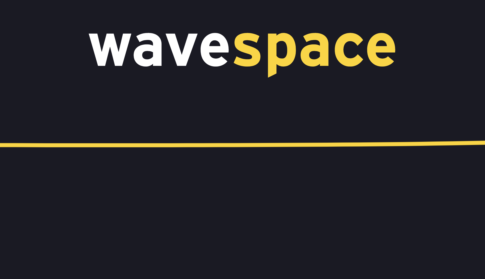

# wavespace Launch

Waiting screen used in the physical space of wavespace™ LAS.


## Getting Started

These instructions will get you a copy of the project up and running on your local machine for development and testing purposes.

See [Deployment](#deployment) for notes on how to deploy the project on a live system.

### Screenshots

<p>
  
</p>

<p>
  
</p>

### Prerequisites

After cloning this repository, enter its root folder and type ```npm install``` in a terminal window. This will download and install all the required packages to make this application functional.

### Installing

Open a terminal window and type ```npm run dev```. This will launch the application in a new browser's tab.

For every change you make in this project, the opened browser window will automatically update.

## Deployment

To bundle the application, type ```npm run build``` in a terminal window. This will generate a ```dist``` folder containing all the compiled code and production-ready files.

In the same terminal window, enter the newly generated ```dist``` folder by typing ```cd dist```.

Then type ```zip -r build.zip .``` to generate a compressed file called ```build.zip```. You can upload this file directly to the web service of your choice.

## Built With

* [Webpack](https://webpack.js.org/) – JavaScript module bundler
* [React](https://reactjs.org/) – JavaScript library for UI

## Contributing

Please feel free to propose new features by raising an [Issue](https://github.com/EYLatamSouth/wavespace-launch/issues/new/choose) or creating a Pull Request.

## Authors

* **Eduardo Basso** – *Initial work* – [eduardobasso](https://github.com/eduardobasso)

See also the list of [contributors](https://github.com/EYLatamSouth/wavespace-launch/contributors) who participated in this project.